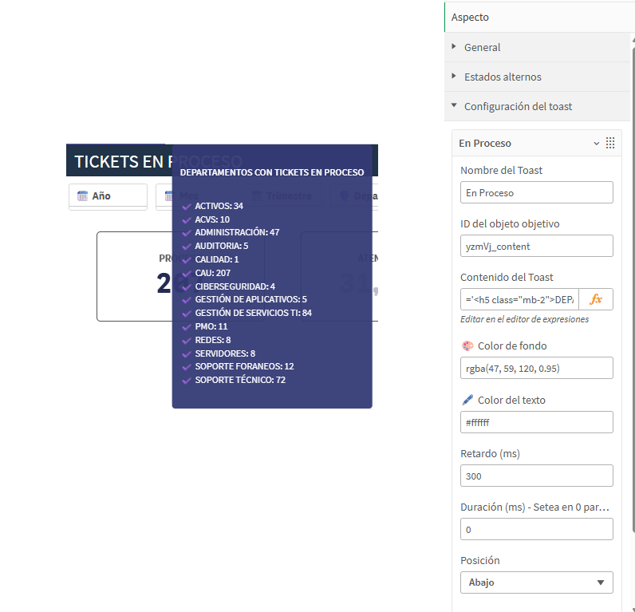

# Ry-Toast-Array para Qlik Sense

**Versión:** 2.0.0  
**Autor:** Daniel Rodríguez – IE Team @ Grupo Reyma

## 📌 Descripción

Componente de notificación tipo "toast" para Qlik Sense. Permite asociar mensajes informativos configurables a objetos KPI u otros visuales.

## 🎯 Funcionalidades

- Configuración dinámica de múltiples toasts
- Personalización de color, posición, duración y retardo
- Compatibilidad con Markdown y listas HTML
- Ideal para mostrar alertas o avisos UX-friendly

## 🛠 Instalación

1. Descarga este repositorio.
2. Copia la carpeta `Ry-Toast-Array` a tu carpeta de extensiones de Qlik Sense:
    C:\Users<tu_usuario>\Documents\Qlik\Sense\Extensions\
3. Reinicia Qlik Sense Desktop o actualiza el hub en Qlik Sense Enterprise.
4. ¡Agrega el objeto desde el panel de visualizaciones personalizadas!

## 🖼 Preview

## 📜 Licencia

MIT

